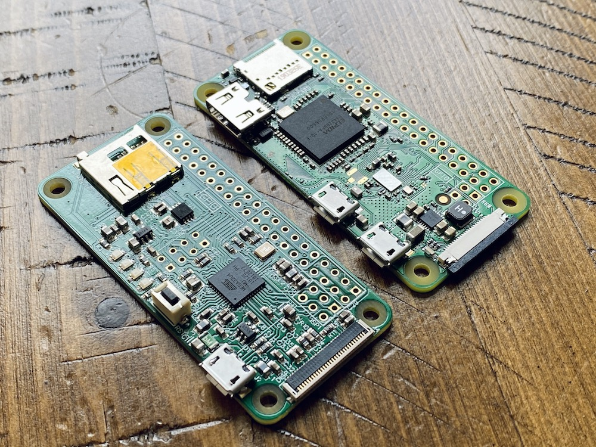

# Introduction to the ATMegaZero

> The ATMegaZero is a microcontroller board based on the Atmel ATMega32U4 microchip, the same chip used in the Arduino Leonardo and Arduino Micro. It was modeled after the Raspberry PI Zero to take advantage of its sleek design and form factor but in the form of a microcontroller board.
Similar to the Raspberry Pi Zero the ATMegaZero comes with 40 GPIO pins that can be used as input or output for interfacing devices and can be programmed using the Arduino IDE software.

# ATMegaZero Press
* [Hackster News](https://www.hackster.io/news/atmega32u4-raspberry-pi-zero-form-factor-atmegazero-3baa0edc65ef)
* [electronics-lab](https://www.electronics-lab.com/meet-the-atmegazero-an-atmega32u4-with-a-raspberry-pi-zero-form-factor/)
* [CNX-Software](https://www.cnx-software.com/2020/09/10/buy-atmegazero-arduino-raspberry-pi-zero-board/)
* [Hackerboards.com](https://hackerboards.com/boards/atmegazero/)
* [Republicaradio.com](https://republicaradio.com/atmegazero/)
* [Microchip](https://www.microchip.com/en-us/about/blog/maker-space/july-hardware-roundup)
* [Programmez.com](https://www.programmez.com/actualites/atmegazero-sur-un-air-de-pi-zero-30891)
* [Electromaker Show](https://www.youtube.com/watch?v=Dg6jNsKS504)
* [Alex Glow - Hackster.io](https://youtu.be/Ul9aS_Bnx2c?t=137)

# Specifications
> The ATMegaZero was designed with makers in mind and here are some of the key
specs that makes this a great microcontroller board:

* Core: ATmega32U4 microcontroller running at 16MHz
* Memory: 32KB Flash, 2.5KB SRAM, 1KB EEPROM
* GPIO: 40 pins header
* Digital I/O: 17
* Analog Input: 6
* GND pins: 8
* +3V3 pins: 2
* +5V pins: 2
* ESP-01 GPIO pins: 2 (direct access to the ESP-01 GPIO pins)
* PWM Channels: 7
* Communication: UART/SPI/I2C
* Micro SD Card module for saving data (read/write)
* 32 pins OLED Display port (compatible with 30 pins SSD1306 & SSD1331)
* Pinout for connecting an ESP-01 WIFI Module
* Operating Voltage: 5V
* Dimensions: 2.6"x1.2" (65mmx30mm)
* Weight: 1.5oz
* Software: Works out of the box with the Arduino IDE (Win/OSX/Linux)

# Main Components

# GPIO Pinout Diagram

# Board Dimensions

# Photos

# Setup & Sample Code

[Setup Instructions](/setup_instructions.md)
 
[Sample Code](/sample_codes.md)

# Pinouts

| Left      |  |  | Right |
| --------- | - | - | ----- |
| +3V3 | **1** | 2 | +5v |
| I2C-SDA | 3 | 4 | +5v |
| I2C-SCL | 6 | 7 | GND |
| HWB | 8 | 9 | TXD1 |
| GND | 10 | 11 | RXD0 |
| D4 | 11 | 12 | D5 |
| D8 | 13 | 14 | GND |
| AREF | 15 | 16 | D7 |
| +3V3 | 17 | 18 | D6 |
| SPI-MOSI | 19 | 20 | GND |
| SPI-MISO | 21 | 22 | D9 |
| SPI-SCLK | 23 | 24 | SPI-CS0 |
| GND | 25 | 26 | D10 |
| *ESP-GPIO2 | 27 | 28 | *ESP-GPIO0 |
| D13 | 29 | 30 | GND |
| D12 | 31 | 32 | A5 |
| A4 | 33 | 34 | GND |
| A3 | 35 | 36 | A2 |
| A1 | 37 | 38 | A0 |
| GND | 39 | 40 | PD5 |