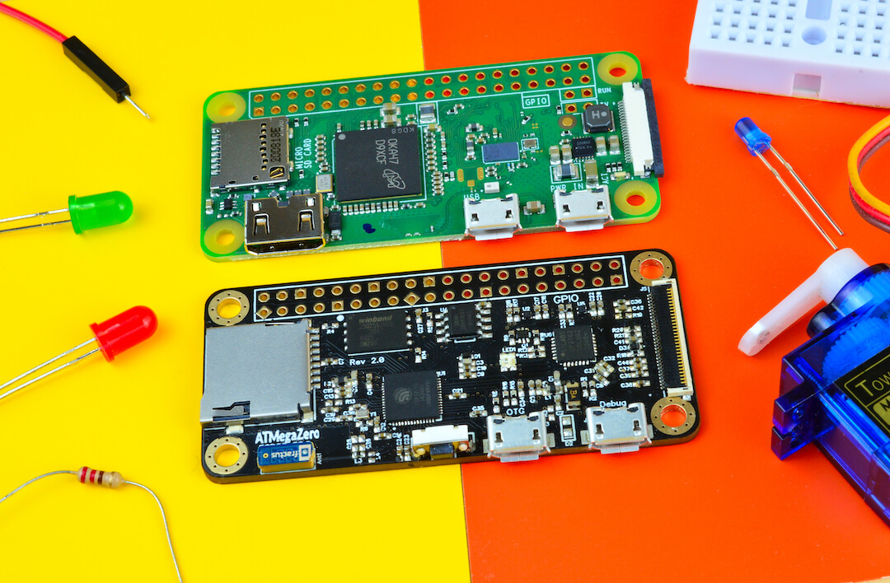
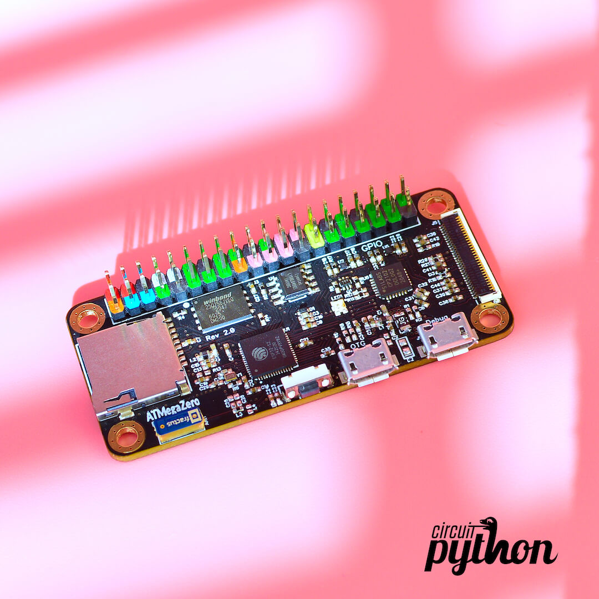

# Overview

> The ATMegaZero ESP32-S2 is a full-featured development board based on the Espressif Esp32-S2 microchip.

The ATMegaZero ESP32-S2 is a full-featured development board based on the Espressif Esp32-S2 microchip.  This new version is a highly integrated, low-power, single-core Wi-Fi microcontroller, designed to be secure with high performance and a rich set of IO capabilities. Equipped with an integrated 802.11 b/g/n WiFi 2.4GHz (up to 150Mbps), 32 MB of Flash memory (for firmware and file storage), and 8 MB external PSRAM so you can have massive storage buffers, making it the perfect board for home automation, IoT, robotics or wearable tasks. It comes with an onboard microSD cardholder and a 30-pin OLED display port compatible with the popular SSD1306 & SH1106 IC displays.

The ATMegaZero was modeled after the Raspberry PI Zero to take advantage of its sleek design and form factor but in the form of a microcontroller board. Similar to the Raspberry Pi Zero the ATMegaZero comes with 40 GPIO pins that can be used as input or output for interfacing devices and can be programmed using CircuitPython or the Arduino IDE software. 

# Circuitpython

The ATMegaZero ESP32-S2 ships with the latest version of CircuitPython that supports the ESP32-S2. Just plug your ATMegaZero into your computer and it will appear in your filesystem as a USB flash drive!. Copy your code over, or edit your code directly on the drive. Is that simple!

As newer versions of CircuitPython are released, you are able to update as you require from [circuitpython.org](https://circuitpython.org/board/atmegazero_esp32s2/)
