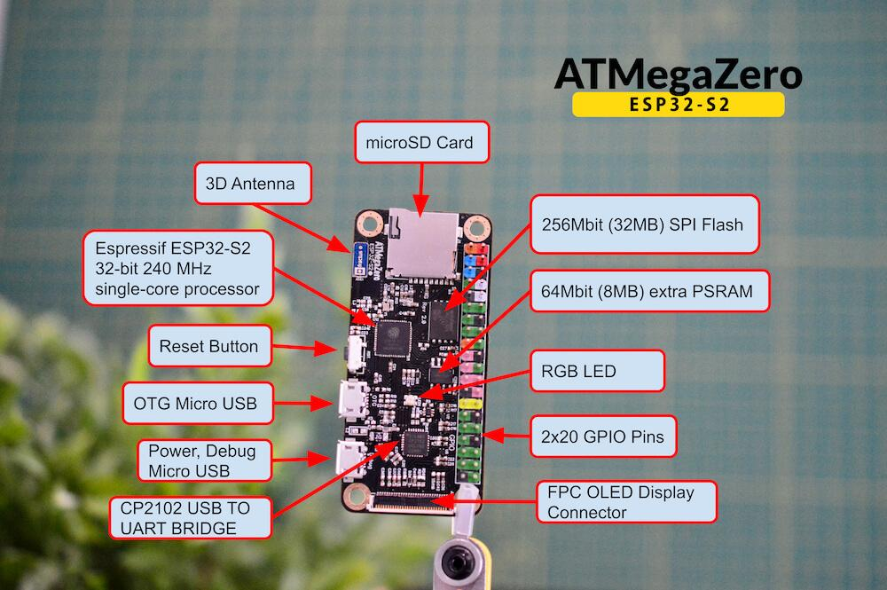
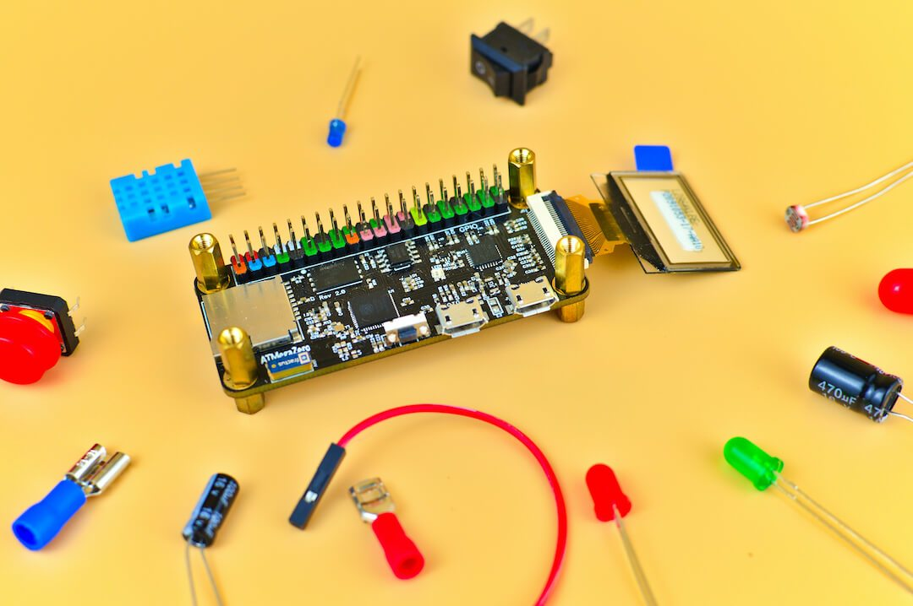

# Specifications
> The ATMegaZero was designed with makers in mind and here are some of the key
specs that makes this a great microcontroller board:

# FEATURES:
* 32-bit 240 MHz single-core processor
* 256Mbit (32MB) SPI Flash but we can only use 16MB at the moment due to firmware limitations.
* 64Mbit (8MB) extra PSRAM
* 2.4 GHz Wi-Fi - 802.11b/g/n
* 3D Antenna
* microSD cardholder
* RGB Neopixel
* FPC Connector for an OLED display
* Raspberry Pi Zero form-factor
* Dimensions: 65mm × 30mm × 5mm
* Micro USB power
* 3.3v 

> Equipped with an integrated 802.11 b/g/n WiFi 2.4GHz (up to 150Mbps), 32 MB of Flash memory (for firmware and file storage), and 8 MB external PSRAM so you can have massive storage buffers, making it the perfect board for home automation, IoT, robotics or wearable tasks

