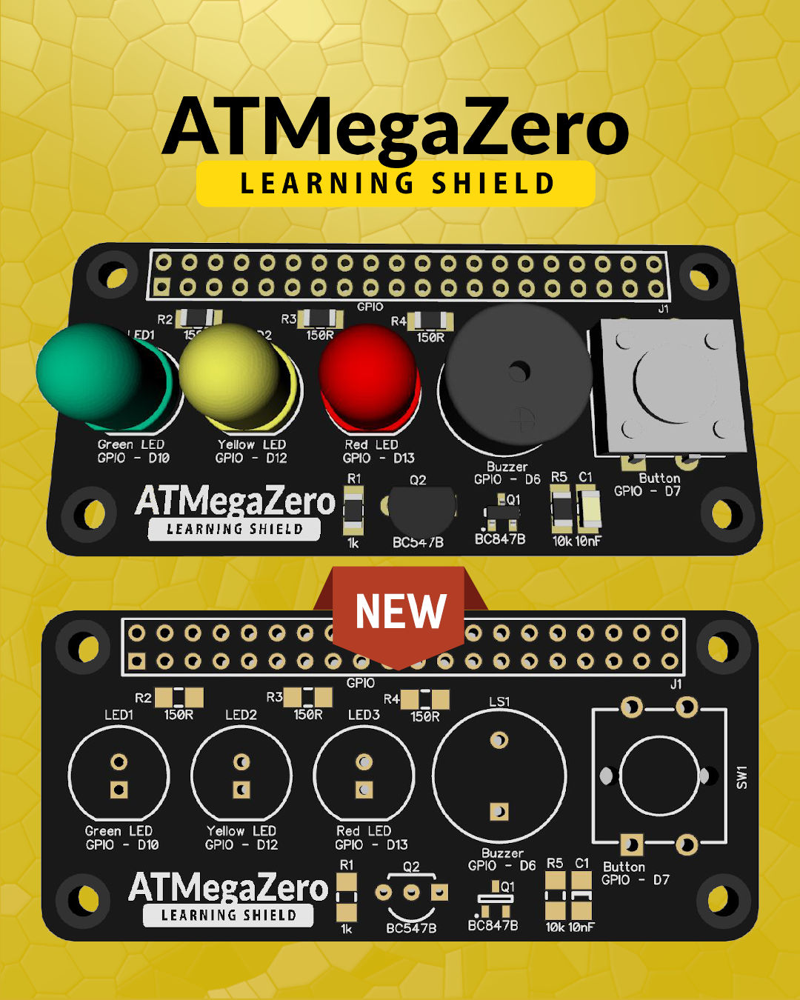

# ATMegaZero Learning Shield

!> Sometimes all it takes is a simple project to get starter tinkering with electronics.  I’m hoping that this little project will help you do that 🤓. 

[Buy it from the ATMegaZero Online Store](https://shop.atmegazero.com/products/atmegazero-learning-shield)

# Features:
* Includes 3 programmable LEDs to learn about outputs
    * Red `(GPIO - D13)`
    * Yellow `(GPIO - D12)`
    * Green `(GPIO - D10)`
* Includes 1 active buzzer connected to a PWM pin to make melodies
    * Buzzer `(GPIO - D6)`
* Includes 1 push button to learn about input
    * Push Button `(GPIO - D7)`

