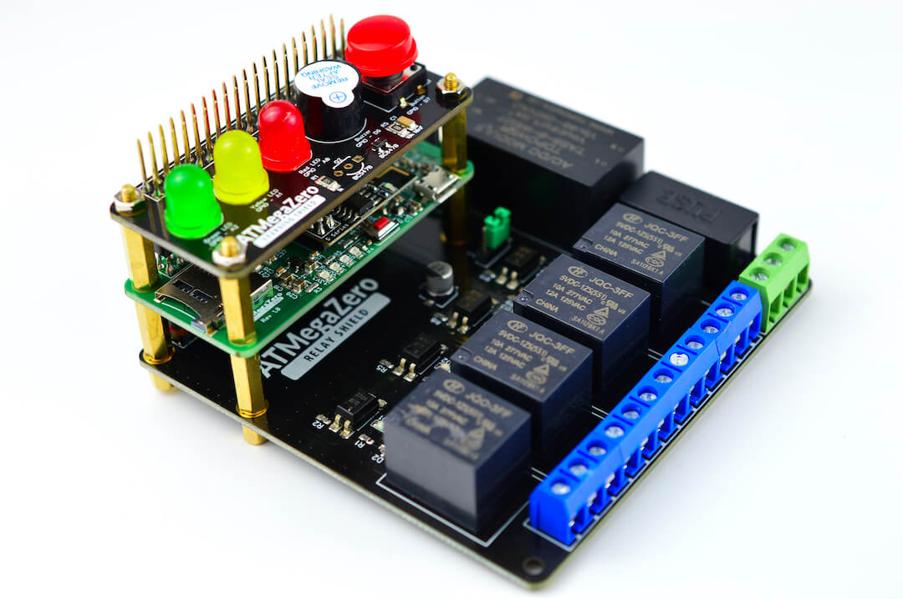

# ATMegaZero Relay Shield

!> PLEASE USE EXTREME CAUTION WHEN WORKING WITH HIGH VOLTAGES

The ATMegaZero Relay Shield is a 4-channel 5v relay interface board, which can be used with the ATMegaZero or the Raspberry Pi. This board allows you to control various appliances and other equipment with large current. The four relays are rated at a max of 220V @10Amp allowing you to control any electric appliance rated at under 2000 Watts.

This 4 Channel 5V Relay Module has the ability to switch up to four circuits using digital signals from the ATMegaZero or the Raspberry Pi. Each relay works like an SPDT Single Pole Double Throw switch and can be wired for both Normally Open (NO) and Normally Closed (NC) operation. The ATMegaZero can flip one of the switches by simply setting the digital output line high. Ideal for the industrial sector, PLC control, home automation, etc.

Compared to other relay boards in the market, the ATMegaZero Relay Shield comes with an integrated Fuse that provides overcurrent protection to the board. 

Each relay channel has a corresponding LED for visual feedback.

The ATMegaZero Relay Shield can power the ATMegaZero Microcontroller using the green connector connected to the power outlet up to 220V. PLEASE USE EXTREME CAUTION WHEN WORKING WITH HIGH VOLTAGES.

You can also power the board by connecting the USB cable to the ATMegaZero microcontroller. The ATMegaZero will send power to the relay shield and allow you to safely work with the board without any risk. If you connect a high voltage electronic into the relay please use extreme caution.

!> WARNING: If using with high voltages (> 24V) use care and common sense! High voltages require experience, and are only for use by engineers who are comfortable with guidelines and know how to use them safely!

?> Important: Relay #4 uses pin 13, which is the same pin as the internal LED on the ATMegaZero board.  Try not to use the internal LED when using this board. Also, you might want to program your ATMegaZero board before connecting it to the relay shield to prevent switching relay #4 On & Off during sketch upload.

> Compatible with the Raspberry Pi Zero/Zero W/Zero WH/2B/3B