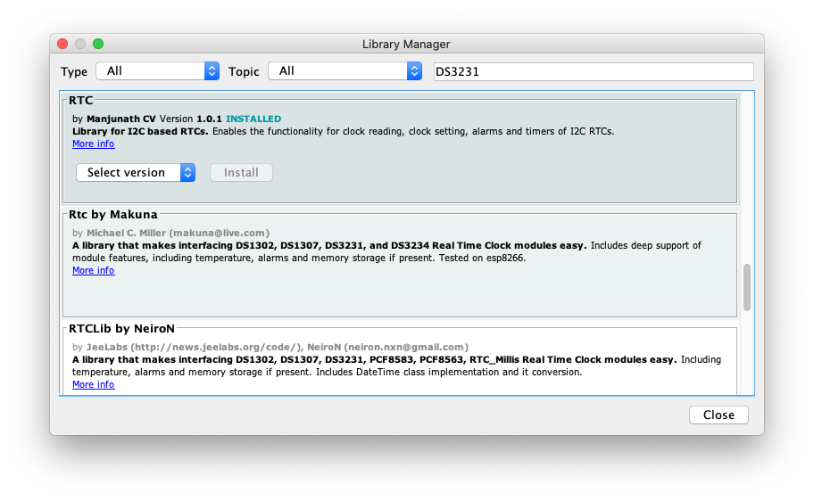

# ATMegaZero RTC Shield Demo

> These sample codes is for testing the ATMegaZero RTC Shield on the Arduino IDE

!> This demo requires the DS3231 RTC library by Manjunath CV. I'm using version 1.0.1 in this demo.



# Sample code to set the Date/Time on the ATMegaZero RTC Shield

```clike
/*
 * This example code is for setting the Date/Time to the ATMegaZero RTC Shield using the Arduino IDE.
 * This demo requries the 'RTC' library to be installed first. https://github.com/cvmanjoo/RTC
 * 
 * You can purchase one of the ATMegaZero RTC Shield from the ATMegaZero Online Store at:
 * https://shop.atmegazero.com/products/atmegazero-rtc-shield-ds3231
 * 
 * For full documentation please visit https://atmegazero.com
 */

#include <Wire.h>
#include <RTC.h>

static DS3231 RTC;

void setup()
{
  Serial.begin(9600);
  delay(100);
  
  RTC.begin();

  Serial.print("Is Clock Running: ");
  if (RTC.isRunning())
  {
    Serial.println("Yes");
    Serial.print(RTC.getDay());
    Serial.print("-");
    Serial.print(RTC.getMonth());
    Serial.print("-");
    Serial.print(RTC.getYear());
    Serial.print(" ");
    Serial.print(RTC.getHours());
    Serial.print(":");
    Serial.print(RTC.getMinutes());
    Serial.print(":");
    Serial.print(RTC.getSeconds());
    Serial.print("");
    
    if (RTC.getHourMode() == CLOCK_H12)
    {
      switch (RTC.getMeridiem()) {
      case HOUR_AM:
        Serial.print(" AM");
        break;
      case HOUR_PM:
        Serial.print(" PM");
        break;
      }
    }
    
    Serial.println("");
    delay(1000);
  }
  else
  {
    delay(1500);

    Serial.println("No");
    Serial.println("Setting Time");
    RTC.setHourMode(CLOCK_H12);
//    RTC.setHourMode(CLOCK_H24);
    RTC.setDateTime(__DATE__, __TIME__);
    Serial.println("New Time Set");
    Serial.print(__DATE__);
    Serial.print(" ");
    Serial.println(__TIME__);
    RTC.startClock();
  }
}

void loop()
{

}
```

# Sample code for reading the Date/Time from the ATMegaZero RTC Shield

```clike
/*
 * This example code is for testing the ATMegaZero RTC Shield with the Arduino IDE.
 * This demo requries the 'RTC' library to be installed. https://github.com/cvmanjoo/RTC
 * 
 * You can purchase one of the ATMegaZero RTC Shield from the ATMegaZero Online Store at:
 * https://shop.atmegazero.com/products/atmegazero-rtc-shield-ds3231
 * 
 * For full documentation please visit https://atmegazero.com
 */
 
#include <Wire.h>
#include <RTC.h>

static DS3231 RTC;

void setup()
{
  Serial.begin(9600);
  delay(100);
  
  RTC.begin();
  RTC.setHourMode(CLOCK_H12);
}

void loop()
{
  switch (RTC.getWeek())
  {
    case 1:
      Serial.print("SUN");
      break;
    case 2:
      Serial.print("MON");
      break;
    case 3:
      Serial.print("TUE");
      break;
    case 4:
      Serial.print("WED");
      break;
    case 5:
      Serial.print("THU");
      break;
    case 6:
      Serial.print("FRI");
      break;
    case 7:
      Serial.print("SAT");
      break;
  }
  
  Serial.print(" ");
  Serial.print(RTC.getDay());
  Serial.print("-");
  Serial.print(RTC.getMonth());
  Serial.print("-");
  Serial.print(RTC.getYear());

  Serial.print(" ");

  Serial.print(RTC.getHours());
  Serial.print(":");
  Serial.print(RTC.getMinutes());
  Serial.print(":");
  Serial.print(RTC.getSeconds());
  
  if (RTC.getHourMode() == CLOCK_H12)
  {
    switch (RTC.getMeridiem())
    {
      case HOUR_AM :
        Serial.print(" AM");
        break;
      case HOUR_PM :
        Serial.print(" PM");
        break;
    }
  }
  
  Serial.println();

  Serial.print("RTC Temperature: "); 
  Serial.print(RTC.getTemp());
  Serial.print("'C");

  Serial.println();
  Serial.println();
  delay(1000);
}
```