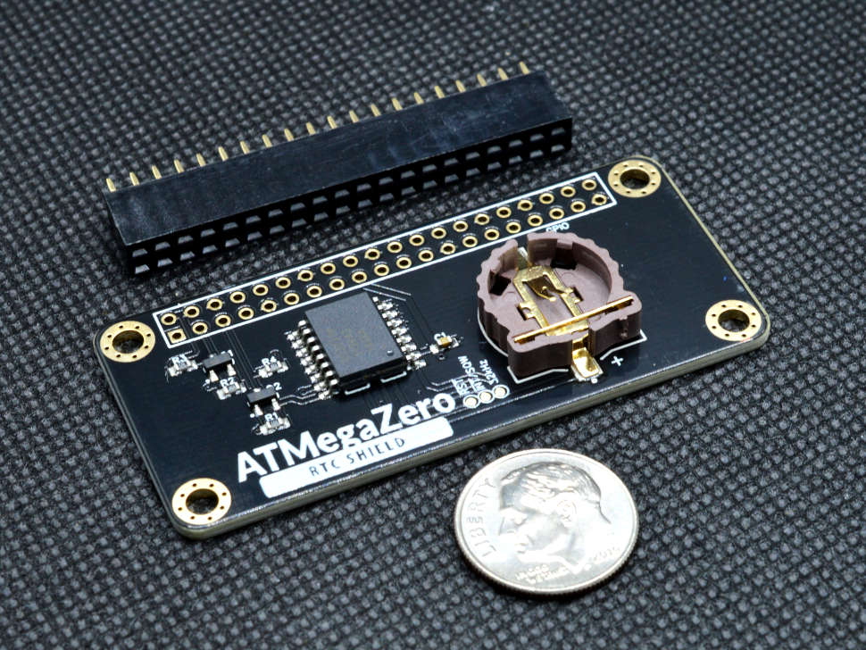

# ATMegaZero RTC Shield

!> Compatible with the Raspberry Pi Zero/Zero W/Zero WH/2B/3B

This is the ATMegaZero RTC Shield based on the DS3231 chip which has an extremely accurate I2C real-time clock (RTC) with an integrated temperature-compensated crystal oscillator (TCXO).

Most RTCs use an external 32kHz timing crystal that is used to keep time with low current draw. But those crystals have slight drift, particularly when the temperature changes (the temperature changes the oscillation frequency very very very slightly but it does add up!) This RTC is in a beefy package because the crystal is inside the chip! And right next to the integrated crystal is a temperature sensor. That sensor compensates for the frequency changes by adding or removing clock ticks so that the timekeeping stays on schedule.

This RTC Shield requires a CR1220 12mm coin cell (not included) plugged into the battery holder, you can get years of precision timekeeping, even when main power is lost.

A CR1220 coin cell is required to use the battery-backup capabilities! We don't include one by default, to make shipping easier for those abroad.

This is an excellent addon for the ATMegaZero board which gives your project the ability to accurately know the Data/Time which makes it perfect for data logging, home automation, clock, etc.

