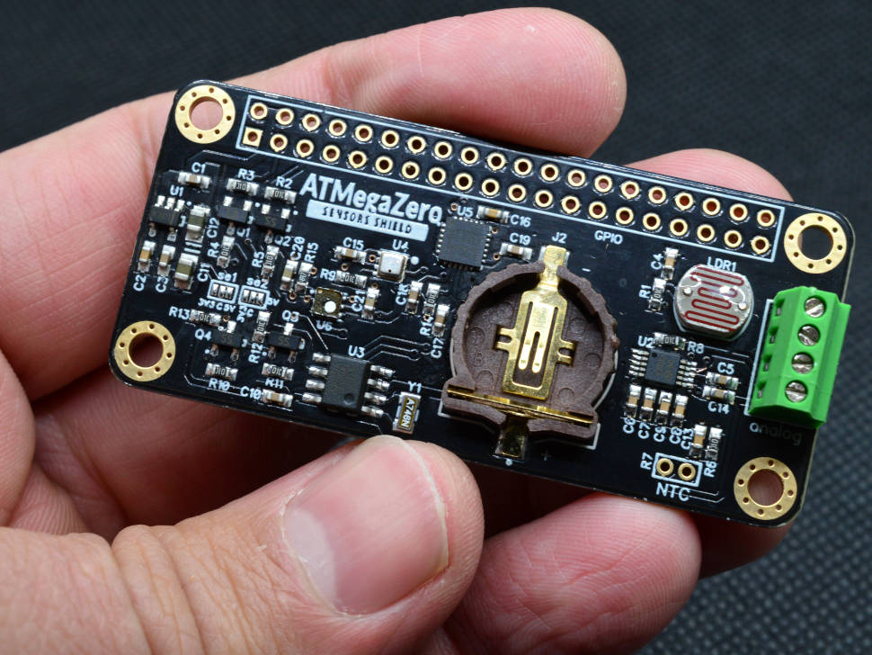
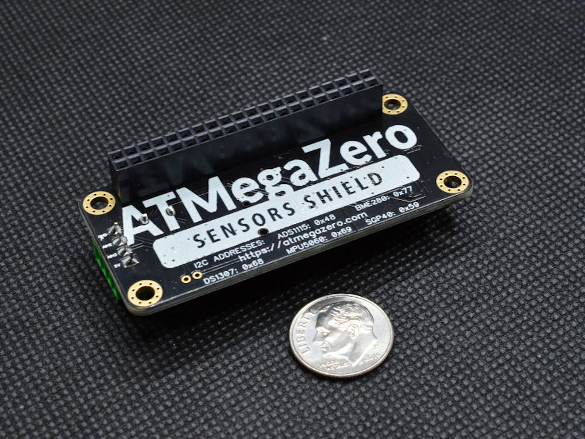

# ATMegaZero Sensors Shield

!> Compatible with the Raspberry Pi Zero/Zero W/Zero WH/2B/3B

The ATMegaZero Sensors shield comes jam-packed with sensors to monitor the environment.

With this tiny board, you can monitor:

* Temperature
* Humidity
* Light level
* Barometric pressure
* Six-Axis Gyro Accelerometer
* Air quality (VOC sensor) and volatile organic compounds
* Real-time Clock (RTC)

# Features:
On the analog side, we have an LDR and NTC connected to ADS1115, and two additional analog inputs from the ADS1115(0-5V) connected to the screw terminal.

- Real-Time Clock (RTC) based on DS1307
- BME280 digital humidity, barometric pressure, and ambient temperature sensor
- MPU6050 six-axis Gyro accelerometer 
- SGP40 VOC sensor - for indoor air quality and volatile organic compounds

!> A CR1220 coin cell is required to use the battery-backup capabilities! We don't include one by default, to make shipping easier for those abroad.

This is an excellent addon for the ATMegaZero board or the Raspberry Pi which gives your project the ability to accurately know the Data/Time which makes it perfect for data logging, home automation, clock, etc.

In the back of the board, you'll find the i2c address for each sensor. 

!> Make sure to use the correct i2c address when you initiate the i2c library for each sensor.