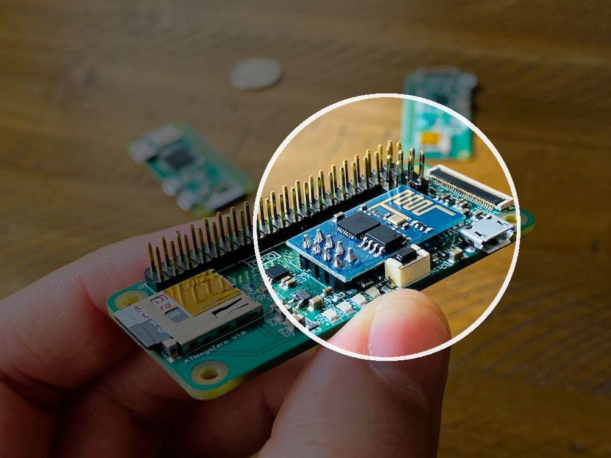

# ESP8266 Overview

The ESP8266 WiFi Module is a self contained SOC with integrated TCP/IP protocol stack that can give any microcontroller access to your WiFi network. The ESP8266 is capable of either hosting an application or offloading all WiFi networking functions from another application processor. Each ESP8266 module comes pre-programmed with an AT command set firmware, meaning, you can simply connect it to the ATMegaZero and write some AT Commands to get you connected to the internet. The ESP8266 module is an extremely cost effective board with a huge, and ever growing, community.

!>The ESP8266 used for the ATMegaZero is the ESP-01(S). We encourage to use the latest model which is the ESP-01S instead of the ESP-01. Both will work, but for best results please use the latest model.

# 🚨 Important read this first 🚨 
?>The ATMegaZero uses software serial communication to talk to the ESP8266 module. The pins designated for Software Serial Communication for the ESP8266 module are `D8 for ESP_RX and D9 for ESP_TX`. Also pin `D5 is connected to ESP_RST` and `D4 is connected to ESP_CH_PD`. Keep in mind these connections when using the ATMegaZero and the ESP8266 module. Try to avoid using pins `D4 & D5` when using the ESP8266 to prevent reseting the ESP8266 during operation.

# Things to keep in mind

1. The RST pin of the ESP8266 module is pulled up to 3.3V via 10k resistor, the same line goes to Atmega32U4 D5 pin (PC6/OC3A/~OC4A)
2. The CH_PD pin of the ESP8266 module is pulled up to 3.3V via 10k resistor, the same line goes to Atmega32U4 D4 pin (PD4/ICP1/ADC8)

The two pins on the Atmega32U4 side are allways pulled up to 3.3V, the end user needs to take a note when using these two pins.
The RST and CH_PD pins have 2 jumpers on the bottom side of the board, the jumpers are connected to GND, and if shorted out the pins will always be tied to GND.

If the end user does not plan to use the ESP8266 module on the board, they can remove resistor `R14` and `R15` from the board. `R14 is the pull-up resistor for D5 pin`, `R15 is the pull-up resistor for D4 pin`.
