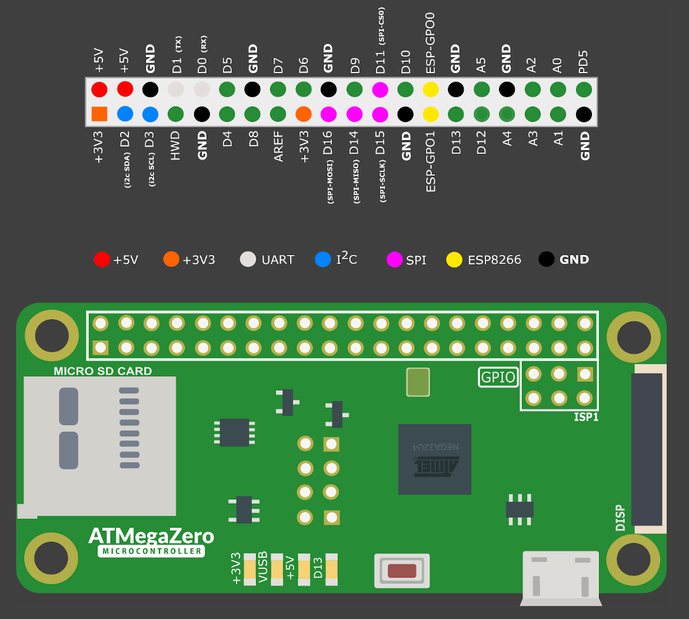
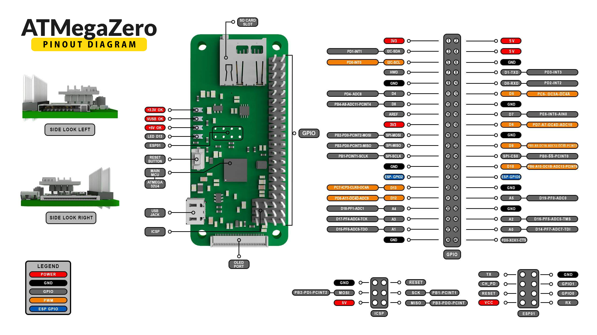

# ATMegaZero 32u4 GPIO Pinout

?> The ATMegaZero comes with 40 GPIO pins that can be used as input or output for interfacing devices and can be programmed using the Arduino IDE software.

|| Left Pins        |                      |                     | Right Pins                 ||
|-| ----------:     |:--------------------:|--------------------:|:---------------------------||
|| 3.3v             | :red_circle:         | :red_circle:        | 5v                         ||
|SDA| D2            | :large_blue_circle:  | :red_circle:        | 5V                         ||
|SCL| D3            | :large_blue_circle:  | :black_circle:      | GND                        ||
|| HWD              | :white_circle:       | :large_blue_circle: | D1                         |TX|
|| GND              | :black_circle:       | :large_blue_circle: | D0                         |RX|
|| D4               | :white_circle:       | :white_circle:      | D5                         ||
|| D8               | :white_circle:       | :black_circle:      | GND                        ||
|| AREF             | :white_circle:       | :white_circle:      | D7                         ||
|| 3.3v             | :red_circle:         | :white_circle:      | D6                         ||
|SPI-MOSI| D16      | :large_blue_circle:  | :black_circle:      | GND                        ||
|SPI-MISO| D14      | :large_blue_circle:  | :white_circle:      | D9                         ||
|SPI-SCLK| D15      | :large_blue_circle:  | :large_blue_circle: | D11                        |SPI-CS0|
|| GND              | :black_circle:       | :white_circle:      | D10                        ||
|| ESP-GPIO1        | :x:                  | :x:                 | ESP-GPIO0                  ||
|| D13              | :white_circle:       | :black_circle:      | GND                        ||
|| D12              | :white_circle:       | :white_circle:      | A5                         ||
|| A4               | :white_circle:       | :black_circle:      | GND                        ||
|| A3               | :white_circle:       | :white_circle:      | A2                         ||
|| A1               | :white_circle:       | :white_circle:      | A0                         ||
|| GND              | :black_circle:       | :white_circle:      | PD5                        ||

# GPIO Pinout Color Code

# GPIO Pinout Diagram
!> Click or tap on the image to enlarge it.

