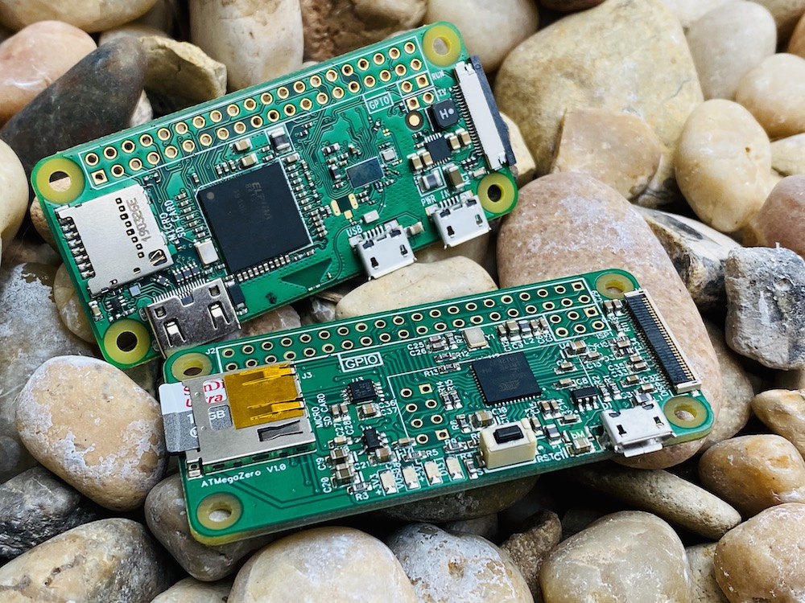

# Introduction to the ATMegaZero

!> The ATMegaZero is a microcontroller board based on the Atmel ATMega32U4 microchip, the same chip used in the Arduino Leonardo and Arduino Micro. It was modeled after the Raspberry PI Zero to take advantage of its sleek design and form factor but in the form of a microcontroller board.
Similar to the Raspberry Pi Zero the ATMegaZero comes with 40 GPIO pins that can be used as input or output for interfacing devices and can be programmed using the Arduino IDE software. The ATMegaZero comes with a built-in USB which makes the ATMegaZero recognizable as a mouse or keyboard.

> [Buy it from our Online Store](https://shop.atmegazero.com)

