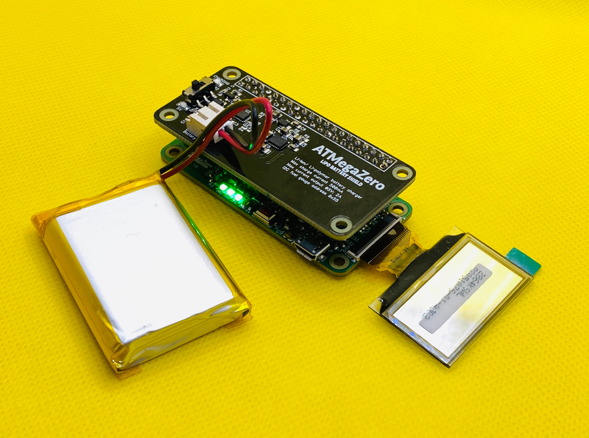

# ATMegaZero LIPO Battery Shield Overview

!> Now you can take your projects on the go with this new shield for the ATMegaZero or the Raspberry Pi.

[Buy it from the ATMegaZero Online Store](https://shop.atmegazero.com/products/atmegazero-lipo-battery-shield)

# Features:
* On-board Maxim fuel gauge IC
* Support reading battery information via I2C 
* Lithium battery charge/discharge protection and over-heating protection
* Powers the ATMegaZero or the Raspberry PI via GPIO.
* **Compatible with the Raspberry Pi Zero/Zero W/Zero WH/2B/3B**

