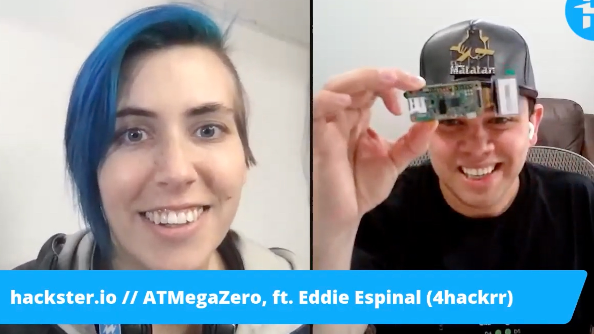

# ATMegaZero Press
> Thank you all for supporting the ATMegaZero project.

!> Watch the Hackster.io interview with Alex Glow & Eddie Espinal

* [Hackster News](https://www.hackster.io/news/atmega32u4-raspberry-pi-zero-form-factor-atmegazero-3baa0edc65ef)
* [electronics-lab](https://www.electronics-lab.com/meet-the-atmegazero-an-atmega32u4-with-a-raspberry-pi-zero-form-factor/)
* [CNX-Software](https://www.cnx-software.com/2020/09/10/buy-atmegazero-arduino-raspberry-pi-zero-board/)
* [Hackerboards.com](https://hackerboards.com/boards/atmegazero/)
* [Republicaradio.com](https://republicaradio.com/atmegazero/)
* [Microchip](https://www.microchip.com/en-us/about/blog/maker-space/july-hardware-roundup)
* [Programmez.com](https://www.programmez.com/actualites/atmegazero-sur-un-air-de-pi-zero-30891)
* [Electromaker Show](https://www.youtube.com/watch?v=Dg6jNsKS504)
* [Alex Glow - Hackster.io](https://youtu.be/Ul9aS_Bnx2c?t=137)