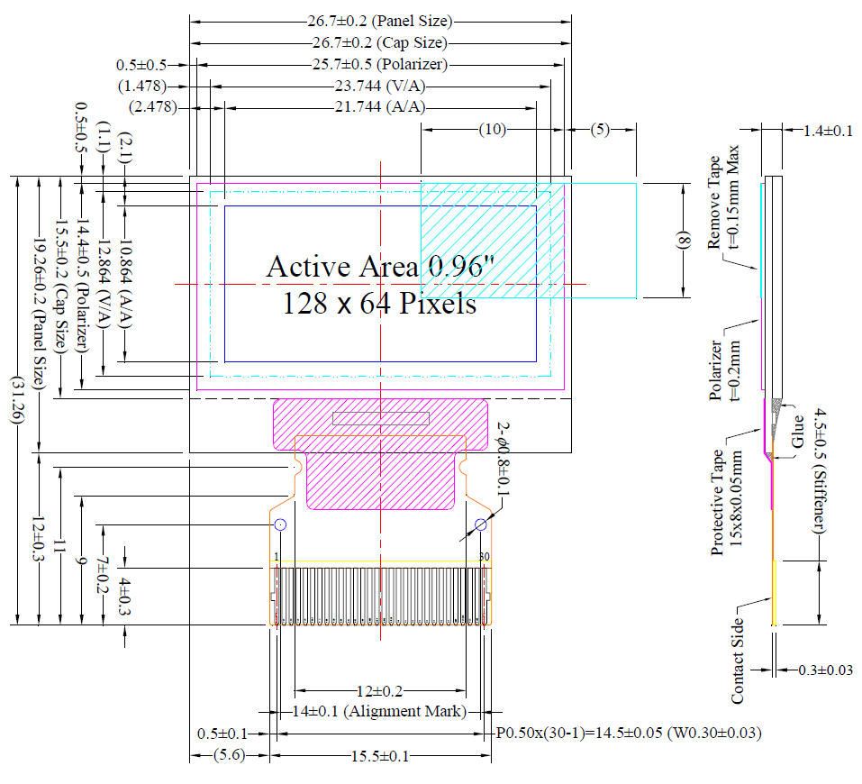

# Recommended Hardware

# ESP8266 Programmer
> In order to program the ESP-01 module, you need to use a USB programmer similar to the one below. 

# OLED Display
> The ATMegaZero supports an SSD1306 OLED display connected to the FPC Connector on the board. Please make sure that the connector on the OLED display is 30 pins with 0.5mm pitch spacing.

