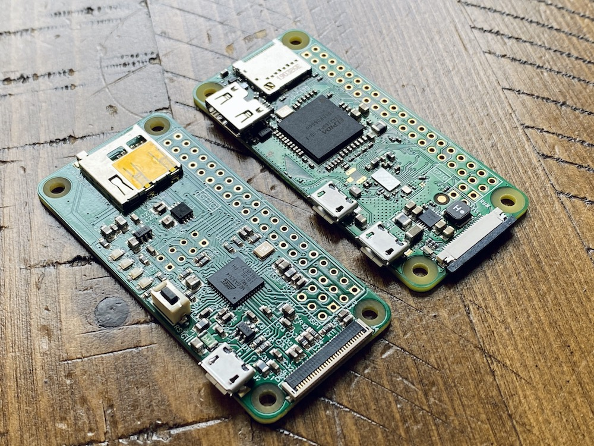

# Specifications
> The ATMegaZero was designed with makers in mind and here are some of the key
specs that makes this a great microcontroller board:

* Core: ATmega32U4 microcontroller running at 16MHz
* Memory: 32KB Flash, 2.5KB SRAM, 1KB EEPROM
* GPIO: 40 pins header
* Digital I/O: 20
* Analog Input: 6
* GND pins: 8
* +3V3 pins: 2
* +5V pins: 2
* ESP-01 GPIO pins: 2 (direct access to the ESP-01 GPIO pins)
* PWM Channels: 7
* Communication: UART/SPI/I2C
* Micro SD Card module for saving data (read/write)
* 32 pins OLED Display port (compatible with 30 pins SSD1306 & SSD1331)
* Pinout for connecting an ESP-01 WIFI Module
* Operating Voltage: 5V
* Dimensions: 2.6"x1.2" (65mmx30mm)
* Weight: 1.5oz
* Software: Works out of the box with the Arduino IDE (Win/OSX/Linux)

# Board Dimensions
